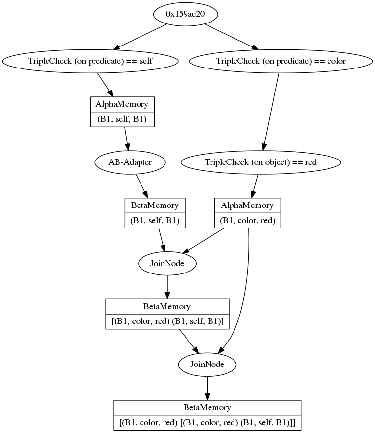
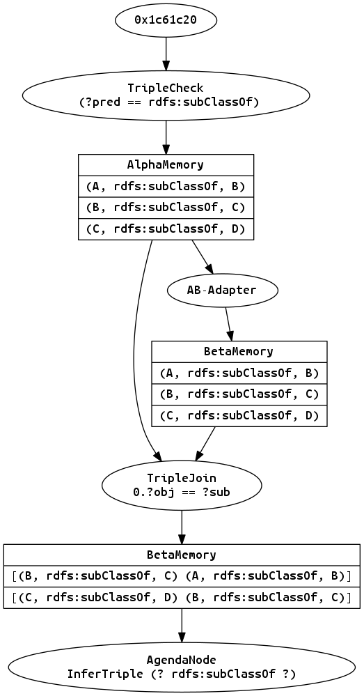
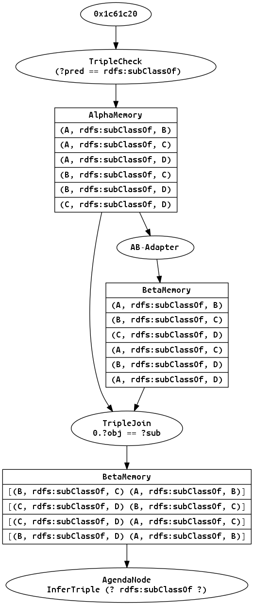
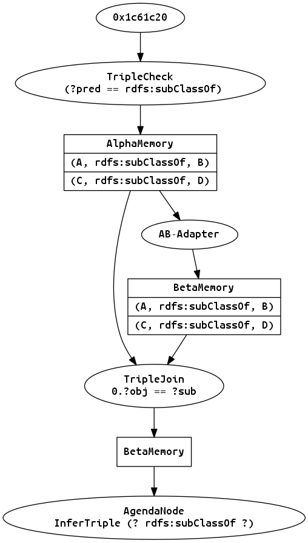
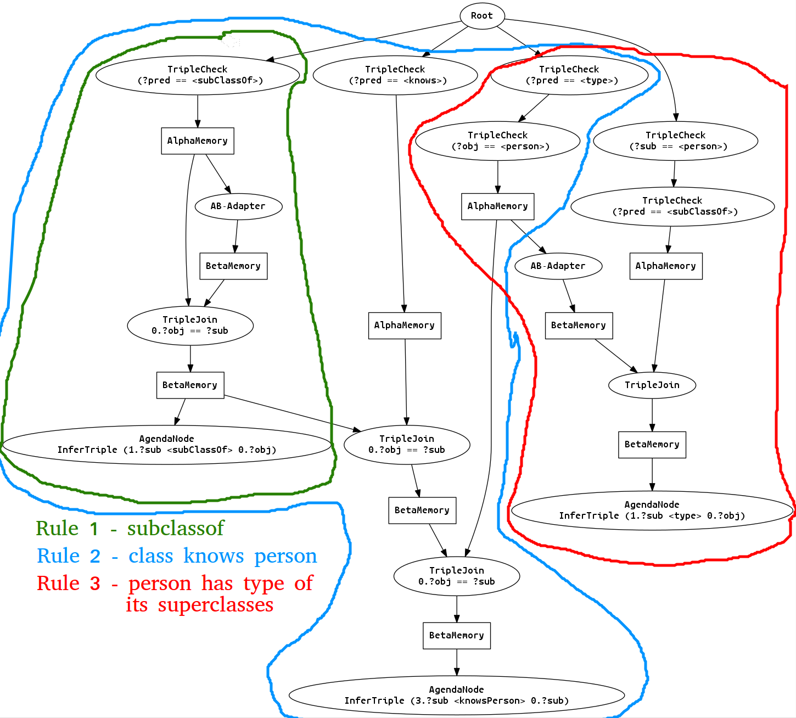
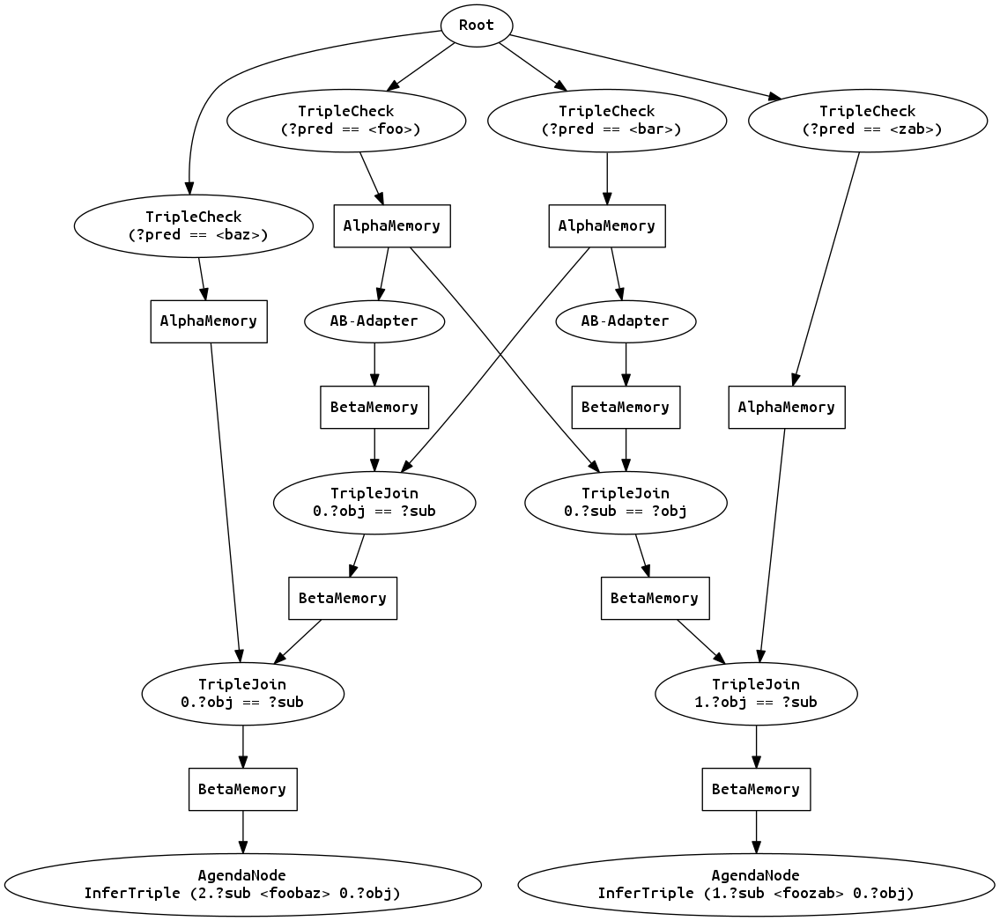
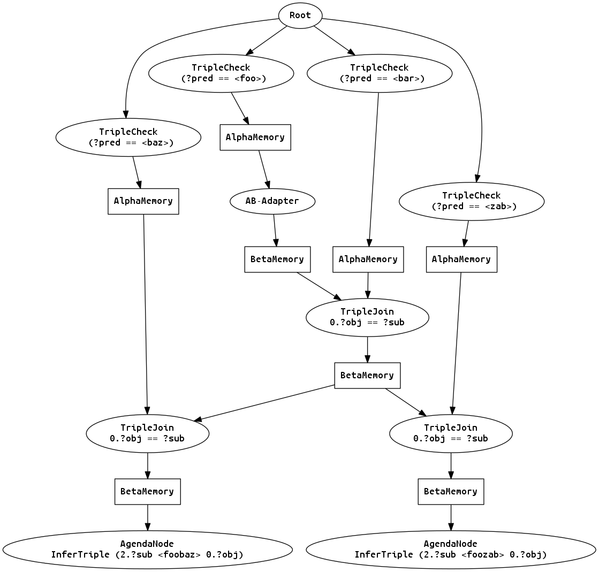

[](https://git.hb.dfki.de/nniemann/rete/commits/master)

# Rete Algorithm in C++

Rete is an algorithm for efficient pattern matching which is often used in business production rule systems to perform forward inference: The rules are translated into a graph structure, the rete (network), where every node implements some part of the condition-checks. By storing intermediate results in memory nodes, and reusing these nodes whenever possible, for multiple rules, the Rete algorithm gains improved evaluation speed (incremental updates are possible) on the cost of increased memory usage.

The algorithm is nothing new, but many implementations in c++ are rather small, unfinished hobby projects, are hidden in proprietary software or released under another license I'd rather not use (e.g. GPL). So, this is my attempt to implement the Rete algorithm, which also allows me to implement my own hooks and extensions.

If you are interested in how it works, please note the detailed description in [Robert B. Doorenbos' PhD thesis ('95)](reports-archive.adm.cs.cmu.edu/anon/1995/CMU-CS-95-113.pdf). I use it as a reference, but I won't implement it exactly as described there, neither will I include all the optimizations he describes. My main focus is on getting a working rule engine I can tweak to my demands.

My first use case will be symbolic reasoning on rdf data, so while the algorithm in principle is of very general nature, I include some code in here for that use case. Hopefully it will still be extensible for other use cases.

The project is split into three parts:

- **rete-core:** Contains the classes needed for every rete network: Alpha- and Beta-Nodes and -Memories, ProductionNodes, the Agenda, Tokens and an abstract working memory element (WME).
- **rete-rdf:** Implements a few specific classes to work with rdf triples: The Triple-class itself (a WME), and checks for specific entries in the triples, as well as consistency checks (e.g. if subject == object).
- **rete-reasoner:** Builds a rule-based reasoner that works with rdf triples around the previous parts. It Adds the notion of "Evidences" for a fact/WME, which can be just asserted or inferred through a token-production-combination. It keeps track of all evidences for facts/WMEs, thus allowing a single fact to be inferred through different rule activations, while still ensuring that everything is firmly grounded in asserted facts and no self-inferring loops persist. Also, this part includes the first version of a parser to create the rete-network for the reasoner from a textual description of rules.


## Network

The core of this library is the support structure for rete networks, consisting of the working memory elements (WME), the different node types and other things only exist for the core structure, without any concrete reasoning functionality, without being pre-defined to any type of knowledge etc. The main parts are the following:

### rete::Network

While the rete network is constructed implicitly by connecting nodes, the Network-class contains a single node which should be used as the top-level entry-point into the network. It also provides a method to create a description of the current state of the network in a dot-file format.

### rete::WME

The working memory element (WME) class is the base for all types of knowledge that is to be processed in the rete network. An example for a concrete type is the rete::Triple class which represents simple string triples, but you may implement whatever you need here. Just make sure that a WME must be constant within the network, and every change must be stated explicitly by retracting and asserting WMEs.

WMEs are also used to store the values of (custom) builtin nodes. The semantics differ towards "normal" WMEs: Those computed in a builtin simply hold in the context of a (partly-) matched rule (see Token below). This is relevant for the reasoning process explained later on.

### rete::TupleWME

The TupleWME-class is a template class which can be used to easily implement simple WMEs that hold multiple values. It was developed after the first tests with triples, thus although one could express rdf-triples as a `TupleWME<std::string, std::string, std::string>`, this is not the case, and IMHO should not be done in such a way. The entries in an RDF-Triple are more than just strings, even though they are implemented as such. The TupleWME is rather considered to be a utility class for custom builtins or other nodes that might want to compute values (int, double, string, ...) from the given token, and store their result in the token by adding a TupleWME.

### rete::Accessor / rete::StringAccessor / rete::NumberAccessor / ...

The nodes in a network implement checks on the WMEs that are processed through it. Since the basic rete network should be applicable in different domains, with different implementations for WMEs etc., a more or less WME-independent way of accessing values inside the WME is needed. But at the same time the nodes will need to know the datatype they get. The following structure is an approach to solving this problem: The `rete::Accessor` is the base class for objects that can be used to extract values from WMEs, and from WMEs in tokens. The idea is that when constructing the network you know the structure of the tokens at each node, and you also know which value you want to extract from which WME in the token to process it in a node in the network. Hence you can create a `rete::Accessor` instance and hand it to the node, which no longer needs to know the type of the WME it gets to extract the value from itself. Think of it as some kind of variable bindings. The next problem is that you cannot specify an interface to _arbitrary_ data. So the `rete::Accessor` has no methods to access the data directly, it can only be asked which more concrete interfaces it implements: `rete::StringAccessor` and `rete::NumberAccessor`. Be aware that the latter also implements the `rete::StringAccessor` interface, so that numbers can also be interpreted as strings. You can use `accessor->canAs<rete::NumberAccessor>()` to check for the type, and

```c++
auto numAcc = accessor->as<rete::NumberAccessor>();
if (numAcc->canGetFloat())
{
    float value = numAcc->getFloat();
}
```

To extract a value. The `canGetFloat()` check is optional: It determines if the underlying datatype can be (more or less) safely cast to a float. `canGetFloat()` returns `false` if the underlying datatype is a `double`, as well as `canGetInt()` does if it would try to convert from `long`, `float` or `double`, etc., you get the point. But you can still just cast it.

One implementation of this interface is the `rete::TupleWMEAccessor`, which simply returns n-th value from a `rete::TupleWME`. Please be aware that the accessor itself **does not check** if the given WME is of correct type, but assumes that it is the correct type of TupleWME, since you should know this when constructing the network.

The accessors are especially useful for the rule parser and the reasoner, who need to construct and use a network which is defined in a string given by the user.

> ***NOTE:*** _This is work in progress. Not all the nodes accept accessors by now. Also, the following examples do not take these changes into account, though at the state of this writing, they are all functional (only include paths need to be adjusted)._


### rete::AlphaNode

Alpha nodes perform simple checks on single WMEs. E.g., one node may check if the given WME is a Triple and if the triples predicate is "foo". Next you may append a node to check if the triples object if "bar". Again, implement your own checks. Examples are the classes TripleConsistency and TripleAlpha.

### rete::AlphaMemory

A storage for WMEs that match a the conditions checked by the chain of alpha nodes in front of it. The alpha memories are the barrier between the alpha- and the beta-network.

### rete::BetaNode

Beta nodes generally (with maybe some exceptions) perform checks on multiple WMEs. They can be connected to a BetaMemory and an AlphaMemory and are used to create joins between partial matches (BetaMemory) and the WMEs satisfying the next condition in the clause (AlphaMemory). The results are (extended) Tokens which are stored in the next BetaMemory. See e.g. the TripleJoin class. Think of inter-WME-conditions, while AlphaNodes implement intra-WME-conditions: AlphaNodes are used to find triples of the form "(?a foo bar)" and "(something else ?a)", and a BetaNode makes sure that the subject of the first triple in the results matches the object of the second triple (?a == ?a).

#### Different kinds of join nodes & rete::GenericJoin

The BetaNodes described above are basically join nodes, and there are several implemented by now, **though you should only use the `GenericJoin`:**

- `JoinNode`, an abstract interface for joins
- `JoinUnconditional`, which simply produces all combinations between the entries in the alpha and beta memory
- `TripleJoin`, an implementation of a `JoinNode` which solely works on triples. 
- **`GenericJoin`** is the recommended way to go.  It accepts pairs of `Accessor` objects, which are then applied on the respective token and WME to extract and compare the values. (This is also the reason why the accessors need to implement a `bool canCompareValues(const Accessor& other)` and `bool valuesEqual(Accessor& other, Token::Ptr token, WME::Ptr wme)`).

### rete::Builtin

In order to extend the functionalities of the rete network it is possible to define custom beta nodes that compute values from token, called `rete::Builtin`s. A simple use case would e.g. be to do some simple mathematical computations or comparisons.

>  _**NOTE:** Though the code base for builtins is already implemented, only few builtins exist yet -- namely: Sum, Mul and Div. More will be added later, including string operations etc._

### rete::BetaMemory

Hold partial matching results (tokens).

### rete::Token

A token is a list of <N\> WMEs which fulfill the first <N\> conditions. Tokens are stored in beta memories and are the result of joins done by the beta nodes

### rete::AlphaBetaAdapter

The first beta node in a chain wants a beta memory and an alpha memory, but only alpha memories exist so far. The AlphaBetaAdapter is a BetaNode that is connected to an alpha memory only and simply forwards every entry in the alpha memory as a token to its beta memory, thus converting an alpha- into a beta memory as a starting point for the regular beta network.

### rete::ProductionNode, rete::AgendaNode

At the end of the matching network you may want to react to the found matches. A production node can be connected to a beta memory to do so. In particular, the AgendaNode is used to schedule productions to the agenda whenever a match is found.

### rete::Agenda

The agenda is a list of triples consisting of a token, a production and a propagation flag: The token is the match that was previously found, and the production is what should be executed on the match. The flag however states if the match was just found or is currently being retracted, so that the production can react differently in both cases. By scheduling the productions instead of executing them directly while processing the activations in the network we make sure that no production is executed prematurely, and can also implement a priority system.


## Example Network

> _**NOTE:** This example is a result from a very early stage of development. It is still valid, but you probably want to use the reasoner and rule parser instead of constructing the patterns yourself. Also, the graphical visualization of your network will differ a bit._

The following network represents the pattern `(?a self ?b) (?x color red) (?y color red)`. For more complex patterns like `(?a self ?a) (?a color red)` where you need to intra-consistency checks and conditional joins, see the test files.

You can convert a dot-file to a png using
```
dot -Tpng network.dot > network.png
```
which will give you something like this (old picture, see sections RuleParser/Reasoner for newer images):



## Reasoning

Our main use case for the rete network is not only pattern matching, but _reasoning_. The rete algorithm is used to find matches for the preconditions of the rules, which are then executed to infer new WMEs that are added to the network, and trigger new matches themselves.

To manage the known facts and multiple sources (assertions or inference chains) for them, a few more classes are implemented in a more or less generic way:

### rete::Evidence

Evidences, or rather **proof**s  (*Todo: Change the name?*) are the reasons why a WME is still kept in the knowledge base. They can be **AssertedEvidence** which is given externally, or **InferredEvidence** which describes which production created the WME from which match. Keeping track of evidences has two major advantages:

1. It allows us to inspect where some knowledge comes from. We can now follow the chain of inference back to its origin, and display which rules and matches lead to the final result.
2. When multiple rules and/or matches result in the same inferred WME and one source/evidence is retracted, we can still keep it. _(It is a bit more complicated than this, please read_ **Managing inferred knowledge** _below)_

Of course, this bookkeeping results in some overhead, but is IMHO necessary to correctly handle the removal of formerly valid knowledge.

### rete::BackedWME

A wrapper for WMEs that adds a list of evidences to it.

### rete::Reasoner

The reasoner contains two things: A rete network and a set of BackedWMEs. It allows us to add and remove evidences, and adds/retracts WMEs to/from the network when necessary. It also provides methods to perform the inference. To do so, it simply takes the first item from the networks agenda, executes it and, if a token was asserted, takes inferred WMEs from the production and adds them to the knowledge base, with the token and the production as evidence.

"Executing an AgendaItem" means to call the `execute` method of its production with the provided token and the propagation flag. In case the flag is "ASSERTED" we are performing normal forward inference, and the production is allowed to infer new WMEs. When the flag is "RETRACTED" this is not possible, as the only token we have as a "reason" is currently being removed from the knowledge base. If you want to infer knowledge from the absence of WMEs / tokens, consider implementing negative nodes in the rete network.

### Managing inferred knowledge

When working in a completely monotonic domain, i.e. you only ever add facts to your knowledge base but never remove them, managing the knowledge is easy as you just have to keep a list of the inferred statements. But in general things are not monotonic: A robot environment changes, things appear and disappear, and maybe you even have some rules that infer things when there is _no match_ for some pattern. As soon as you add a fact that leads to a positive match of that pattern you will need to retract a fact. But not so fast! Do you _really_ need to retract it, or are there different paths to infer the fact, and some of them might still be valid?

To handle this problem, the reasoner keeps track of the different sources for a WME. When removing one source, one evidence for a WME the intuitive way is to check if there is still another evidence remaining, and if yes, do not remove it. But this is not entirely correct: We have to consider loops in the inference chain. One simple example is an "equivalent" relation, a symmetric property:

```
(?a <equivalent> ?b) -> (?b <equivalent> ?a)
```

When you add the fact `(<A> <equivalent> <B>)` you get the following evidences:

```
(<A> <equivalent> <B>) <- asserted
(<B> <equivalent> <A>) <- (<A> <equivalent> <B>)
(<A> <equivalent> <B>) <- (<B> <equivalent> <A>)
```

If you now remove the assertion, both facts have remaining evidence -- but they form a cycle.

```
(<B> <equivalent> <A>) <- (<A> <equivalent> <B>)
(<A> <equivalent> <B>) <- (<B> <equivalent> <A>)
```

There can be other, more complex examples. Maybe you have some rules that implicitly express that if any of `n` facts hold, all the others hold, too, through a cycle:

```
[1] -> [2]
[2] -> [3]
...
[10] -> [1]
```

And you may have other rules to infer some of these facts:

```
[X] -> [5]
```

As soon as you add `[X]`, the whole cycle will be inferred. And when you remove `[X]` again, this cycle must be detected and torn down.

Therefore, whenever an evidence is removed, be it from the outside or internally through inferencing, a  check is performed starting from the fact for which the evidence is removed. The goal is not to traverse the whole graph and find all cycles, but to confirm that the one affected fact is still grounded in assertions. To do so, the following algorithm is implemented:

Assume that the fact does not hold and check if any of its evidences is still valid under this assumption.  If any of it is we are good, and do not need to remove the fact. If none is, all the evidences for the fact rely in some way on the fact itself, so we have a cycle to tear down.
An evidence is valid if it is an AssertedEvidence, or an InferredEvidence for which all WMEs/facts involved still hold. To check the facts in the InferredEvidence, the algorithm recurses, adding the facts to this list of facts we assume to not hold, in order to break any cycle. If a fact is found to be valid it is again removed from the list. At the end of the algorithm we know if the fact we wanted to check is still valid, and if not we also have a list of facts that do not hold anymore and are part of the cycle that held the original fact alive. All those facts are removed from the reasoner and the rete network, and thus evidences containing these facts are removed, too, and the whole process recurses until the network is consistent again, where all inferred facts can be tracked down to external assertions.

Yes this is overhead. But necessary.

## Reasoning with RDF triples

Up to this point everything has been rather generic, without actual, sensible representation of knowledge or consequences etc. My main focus with this algorithm is to implement some reasoning on RDF triples, so I present some classes for this here. But you can implement your own stuff, completely unrelated to RDF triples, of course.

### WMEs and nodes

The knowledge representation and some of the nodes used to check conditions have already been described before: TripleAlpha, TripleConsitency and TripleJoin are used to construct the network and find patterns in the set of Triples. To infer a new triple as a consequence of a match, you can use the `InferTriple`-Node.

The following code example implements the rule:
`[(?a rdfs:subClassOf ?b), (?b rdfs:subClassOf ?c) -> (?a rdfs:subClassOf ?c)]`

It then adds the facts: `(A rdfs:subClassOf B)` , `(B rdfs:subClassOf C)` and `(C rdfs:subClassOf D)`. This results in the inferred triples:

```
(A rdfs:subClassOf C)
(A rdfs:subClassOf D)
(B rdfs:subClassOf D)
```

And when the triple `(B rdfs:subClassOf C)` is removed, all three inferred triples get removed, too.

Code (see [SubClassExample.cpp](examples/SubClassOfExample.cpp)):

> _**NOTE:** This example shows what is needed to construct a network for the given task. But by now we have the RuleParser, which you can feed with the above string representation of the rule to construct the whole network. Make sure to check out the description of the RuleParser in later sections of this README._

```c++
#include <iostream>
#include <fstream>

// your include paths will obviously differ.
#include "../include/Network.hpp"
#include "../include/Triple.hpp"
#include "../include/TripleAlpha.hpp"
#include "../include/AlphaMemory.hpp"
#include "../include/JoinNode.hpp"
#include "../include/AlphaBetaAdapter.hpp"
#include "../include/TripleConsistency.hpp"
#include "../include/TripleJoin.hpp"
#include "../include/AgendaNode.hpp"
#include "../include/InferTriple.hpp"

#include "../include/Reasoner.hpp"
#include "../include/AssertedEvidence.hpp"

using namespace rete;


void save(Network& net, const std::string& filename)
{
    std::ofstream out(filename);
    out << net.toDot();
    out.close();
}

int main()
{
    Reasoner reasoner;
    Network& net = reasoner.net();

    // setup network
    //        C1                     C2
    // (?a rdfs:subClassOf ?b) (?b rdfs:subClassOf ?c)

    // predicate check
    auto foo = std::make_shared<TripleAlpha>(Triple::PREDICATE, "rdfs:subClassOf");
    net.getRoot()->addChild(foo);
    foo->initAlphaMemory();

    // adapter for first (and only) join
    auto adapter = std::make_shared<AlphaBetaAdapter>();
    BetaNode::connect(adapter, nullptr, foo->getAlphaMemory());

    // join where object of the most recent wme in the token matches the subject of the wme in the
    //bin                                    |--- C1.?b ------|----- C2.?b -----|
    auto join = std::make_shared<TripleJoin>(0, Triple::OBJECT, Triple::SUBJECT);
    BetaNode::connect(join, adapter->getBetaMemory(), foo->getAlphaMemory());


    // the consequence: construct (C1.?a  rdfs:subClassOf  C2.?c)
    InferTriple::Ptr infer(new InferTriple(
        {1, Triple::SUBJECT},
        "rdfs:subClassOf",
        {0, Triple::OBJECT}
    ));

    // create an AgendaNode for the production
    auto inferNode = std::make_shared<AgendaNode>(infer, net.getAgenda());
    join->getBetaMemory()->addProduction(inferNode);

    // put in some data
    auto t1 = std::make_shared<Triple>("A", "rdfs:subClassOf", "B");
    auto t2 = std::make_shared<Triple>("B", "rdfs:subClassOf", "C");
    auto t3 = std::make_shared<Triple>("C", "rdfs:subClassOf", "D");

    AssertedEvidence::Ptr source(new AssertedEvidence("some named graph or just anything"));
    reasoner.addEvidence(t1, source);
    reasoner.addEvidence(t2, source);
    reasoner.addEvidence(t3, source);

    save(net, "0.dot");  // before inference
    reasoner.performInference();
    save(net, "1.dot");  // after inference
    reasoner.removeEvidence(t2, source); // remove "B foo C"
    reasoner.performInference();
    save(net, "2.dot"); // after removing t2

    return 0;
}
```


The exported dot-files document the state of the rete network.

After inserting the facts, but before performing inference:



You can see all known triples in the AlphaMemory: Only the ones we added manually are present. But notice that the network already found two matches for our rule and added them to the last BetaMemory (read tokens from right to left). Those matches instantiate/trigger/execute the rule as follows:

```
(A rdfs:subClassOf B), (B rdfs:subClassOf C) -> (A rdfs:subClassOf C)
(B rdfs:subClassOf C), (C rdfs:subClassOf D) -> (B rdfs:subClassOf D)
```

This is only the first step. With those new facts more inference can be done, namely:

```
(A rdfs:subClassOf C), (C rdfs:subClassOf D) -> (A rdfs:subClassOf D)
(A rdfs:subClassOf B), (B rdfs:subClassOf D) -> (A rdfs:subClassOf D)
```

As you can see, we have created a situation where one fact `(A rdfs:subClassOf D)` is inferred on two different ways. This is the state of the network after performing inference:




If we now remove our asserted triple `(B rdfs:subClassOf C)` the whole construct collapses and no inferences can be made. The evidences are removed one after the other, until the network is reset to this:




To make use of the inferred statements you will need to catch them when they are created. For this purpose, the reasoner allows registering a callback function `void(WME::Ptr, rete::PropagationFlag)`, e.g.:

```c++
rete::Reasoner r;
auto callback = [](WME::Ptr wme, rete::PropagationFlag flag)
{
    std::cout << (flag == rete::PropagationFlag::ASSERT ? "asserted: " : "retracted: ")
        	  << wme->toString()
        	  << std::endl;
}
r.setCallback(callback);
```


### RuleParser

Of course, constructing the network manually in code is cumbersome. It would be way more convenient to write rules in a simple, text based structure, and let the network be constructed automatically from those rules. This is where the  `rete::RuleParser` comes in: It takes a string as an input, parses it according to the grammar described below, and constructs a rete network from the input, reusing nodes when possible (with limitations).

The grammar is defined in EBNF, for the complete definition see `RuleGrammar.hpp`. The main parts of it are as follows (_simplified, shortened version_):

```
prefixname  ::= alphanum+
prefixdef   ::= '@PREFIX' prefixname ':' iriref
prefixeduri ::= prefixname ':' alphanum+
variable 	::= '?' alphanum+

subject   ::= variable | iriref | blank_node_label
predicate ::= variable | iriref
object    ::= variable | iriref | blank_node_label | literal

argument  	::= quotedString | number | variable;
builtinName ::= alphanum+ (':' alphanum+)?
builtin 	::= builtinName '(' argument* ')'

triple    ::= '(' subject predicate object ')'

precondition ::= triple | builtin
effect 		 ::= triple

rulename ::= alphanum+ ':'
rule   ::= '[' rulename? precondition (',' precondition)* '->' effect (',' effect)* ']'
rules  ::= prefixdef* rule+
```

To shorten the URIs in your rules for RDF based reasoning you may specify prefixes, e.g.:

```
@PREFIX rdfs: <http://www.w3.org/2000/01/rdf-schema#>

[rule1: (?a rdfs:subClassOf ?b), (?b rdfs:subClassOf ?c) -> (?a rdfs:subClassOf ?c)]
```

is equivalent to:

```
[rule1: (?a <http://www.w3.org/2000/01/rdf-schema#subClassOf> ?b),
		(?b <http://www.w3.org/2000/01/rdf-schema#subClassOf> ?c)
		->
		(?a <http://www.w3.org/2000/01/rdf-schema#subClassOf> ?c)]
```

> _**NOTE:** (Prefixes are not used in the following examples, instead URIs are shortened to the smallest patterns our parser currently allows. Be aware that they are not valid URIs, but this is not relevant for the created networks and the reasoning in general.)_

As an example, some non-sense rules and the created network are shown below:

```c++
int main()
{
  RuleParser p;
  Reasoner reasoner;
  Network& net = reasoner.net();

  p.parseRules(
   "[(?a <subClassOf> ?b), (?b <subClassOf> ?c) -> (?a <subClassOf> ?c)]" \
   \
   "[(?x <subClassOf> ?y), (?y <subClassOf> ?z),(?z <knows> ?p), (?p <type> <person>)" \
   "  -> (?x <knowsPerson> ?p)]" \
   \
   "[(?foo <type> <person>), (<person> <subClassOf> ?class) -> (?foo <type> ?class)]",
   reasoner.net()
  );
  save(net, "complexExample.dot");
  return 0;
}
```

The three rules, stating that

1. If a is subclass of b, and b subclass of c then a is subclass of c, too.
2. If the conditions in 1. hold, and c (here: z) 'knows' a person p, then a (here: x) 'knows' p, too.
3. if foo is a person, and person is a subclass of some class, then foo is of that class, too.

result in the following network:




#### Efficient rule design

When designing your own rules, you should be aware of how they get evaluated, and how to optimize the process. The main point to focus on is that the rules are constructed from left to right, and that this is also the order of evaluation of the conditions and consequences inside a rule -- but you should not make assumptions on the evaluation of the rules themselves. The nodes that describe the conditions are shared between the rules.

What does this mean for an efficient rule design?

1. Avoid unconditional joins: Every time you introduce a condition with no previously used variables you create an unconditional join, which can be quite costly, as it creates matches from the cross-product of the two sets of sub-matches.
2. If you implement builtins that do a lot of processing you might want to place them at the end of the rule (if possible), so that they only get evaluated when a lot of other conditions already match and the chance for a complete match is high.
3. When multiple rules use the same conditions, make sure they are in the same order and at the start of the rule! Only then can the parser reuse the subnetwork when during construction of the rete.

I have no good example for the first point yet, and the second one should be clear. For the third take a look at the `GoodAndBadRules.cpp`:

```c++
int main()
{
    RuleParser p;
    Reasoner reasoner;

    /**
        Bad rule design! The first two conditions in the second rule are swapped, 
        so a different joint node will be created, the sub-network duplicated.
    */
    p.parseRules(
        "[(?a <foo> ?b), (?b <bar> ?c), (?c <baz> ?d) -> (?a <foobaz> ?d)]"
        "[(?b <bar> ?c), (?a <foo> ?b), (?c <zab> ?d) -> (?a <foozab> ?d)]",
        reasoner.net()
    );

    save(reasoner.net(), "badRules.dot");

    // -----

    RuleParser p2;
    Reasoner reasoner2;

    /**
        Good rule design: The first two conditions match in the two rules, so this 
        subnetwork is reused.
    */
    p2.parseRules(
        "[(?a <foo> ?b), (?b <bar> ?c), (?c <baz> ?d) -> (?a <foobaz> ?d)]"
        "[(?a <foo> ?b), (?b <bar> ?c), (?c <zab> ?d) -> (?a <foozab> ?d)]",
        reasoner2.net()
    );

    save(reasoner2.net(), "goodRules.dot");

    return 0;
}
```

This code creates two networks with two rules, where only the third condition is different, and in one case the first two conditions are swapped in the second rule. The resulting networks look quite different:






I think you can recognize which network is more efficient. :slightly_smiling_face:

#### Extending the RuleParser

The RuleParser makes excessive use of the accessor objects introduced previously. While constructing the nodes for a single rule, the parser keeps track of the current variable bindings: A binding is a mapping from a variable name to an accessor, which describes how to get the value from a token at this point in the rule. When creating a single precondition (let it be the check for a (single!) triple pattern or a builtin) or an effect, the parser uses `NodeBuilder` object to do so. Currently implemented and registered by default are the `TripleConditionBuilder`, `TripleEffectBuilder` and `MathBuiltinBuilder`. They are selected by the name of the condition/builtin/effect in the rule, and are given an argument list containing constants, bound and unbound variables. The node builders know how to construct the necessary nodes to fulfill their task in the network, need to check the given arguments for their correct types, and must bind all unbound variables to a new accessor that matches the result WME of the created node. E.g., the math builtins always add a  `TupleWME<float>`, and their node builder thus binds a `TupleWME<float>::Accessor<0>` to the first argument, so that it points to the result of the computation.

If you want to use your own builtins, create node builders for them and register those at the rule parser using `parser.registerNodeBuilder<MySuperNodeBuilder>()`. Have a look at the existing builders to see how to implement your own, the code should be well documented.
