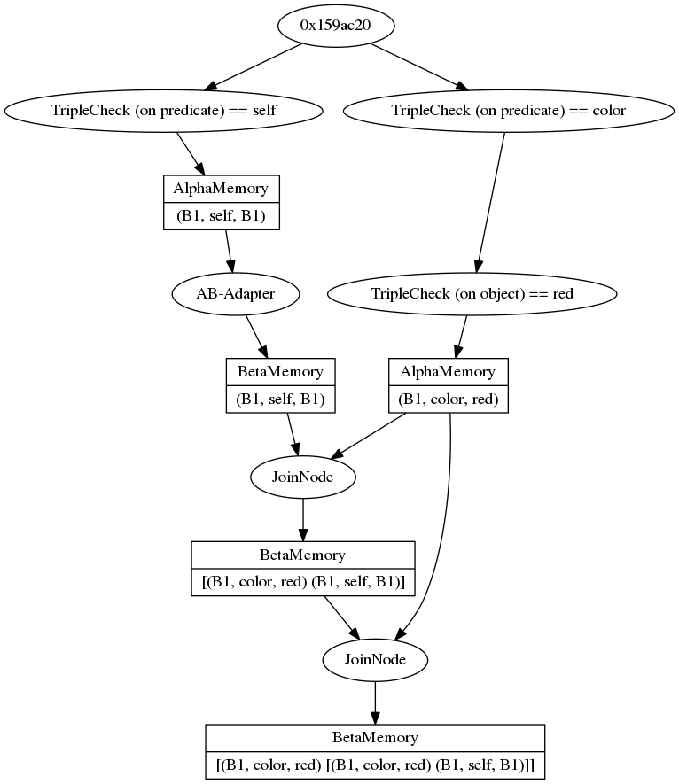

# Rete Algorithm in C++

Rete is an algorithm for efficient pattern matching which is often used in business production rule systems to perform forward inference: The rules are translated into a graph structure, the rete (network), where every node implements some part of the condition-checks. By storing intermediate results in memory nodes, and reusing these nodes whenever possible, for multiple rules, the Rete algorithm gains improved evaluation speed (incremental updates are possible) on the cost of increased memory usage.

The algorithm is nothing new, but many implementations in c++ are rather small, unfinished hobby projects, are hidden in proprietary software or released under another license I'd rather not use (e.g. GPL). So, this is my attempt to implement the Rete algorithm, which also allows me to implement my own hooks and extensions.

If you are interested in how it works, please note the detailed description in [Robert B. Doorenbos' PhD thesis ('95)](reports-archive.adm.cs.cmu.edu/anon/1995/CMU-CS-95-113.pdf). I use it as a reference, but I won't implement it exactly as described there, neither will I include all the optimizations he describes. My main focus is on getting a working rule engine I can tweak to my demands.

My first use case will be symbolic reasoning on rdf data, so while the algorithm in principle is of very general nature, I include some code in here for that use case. Hopefully it will still be extensible for other use cases.

## Usage
Normally you'll want to use a custom parser to create networks to represents certain rules. In this stage of development I'm currently construction them manually, and there is still a bit todo in terms of usability -- not to mention missing features.

But for now, this is what you can get:
```c++
#include <iostream>
#include <fstream>

#include <rete/Rete.hpp>

using namespace rete;

int main(int argc, char** args)
{
    Network net;

    /*
        Example:
            (?x self ?y) &&
            (?x color red) &&
            (?y color red)
        NOTE: The JoinNode currently does not check for matching variable bindings, but
        simply produces the complete cross product of both sides.
    */
    auto root = net.getRoot();
    // (?x self ?y)
    TripleAlpha::Ptr a1(new TripleAlpha(Triple::PREDICATE, "self"));
    root->addChild(a1);

    // (?x color red), reused for (?y color red)
    TripleAlpha::Ptr b1(new TripleAlpha(Triple::PREDICATE, "color"));
    root->addChild(b1);

    TripleAlpha::Ptr b2(new TripleAlpha(Triple::OBJECT, "red"));
    b1->addChild(b2);

    a1->initAlphaMemory(); // explicitly state that the results shall be stored
    b2->initAlphaMemory(); // in an AlphaMemory

    // add an adapter for the first BetaNode
    AlphaBetaAdapter::Ptr ab(new AlphaBetaAdapter(a1->getAlphaMemory()));
    a1->getAlphaMemory()->addChild(ab);

    // (?x self ?y) && (?x color red)
    JoinNode::Ptr j1(new JoinNode(ab->getBetaMemory(), b2->getAlphaMemory()));
    ab->getBetaMemory()->addChild(j1); b2->getAlphaMemory()->addChild(j1);

    // (?x self ?y) && (?x color red) && (?y color red)
    JoinNode::Ptr j2(new JoinNode(j1->getBetaMemory(), b2->getAlphaMemory()));
    j1->getBetaMemory()->addChild(j2); b2->getAlphaMemory()->addChild(j2);


    // add knowledge
    Triple::Ptr t1(new Triple("B1", "self", "B1"));
    Triple::Ptr t2(new Triple("B1", "color", "red"));

    root->activate(t1);
    root->activate(t2);


    // write network to file
    std::ofstream file("network.dot");
    file << net.toDot();
    file.close();

    return 0;
}
```

You can convert the dot-file to a png using
```
dot -Tpng network.dot > network.png
```
which will give you something like this:

